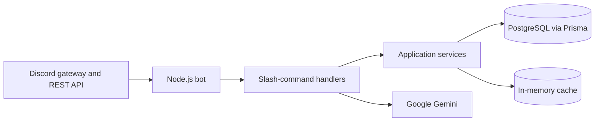
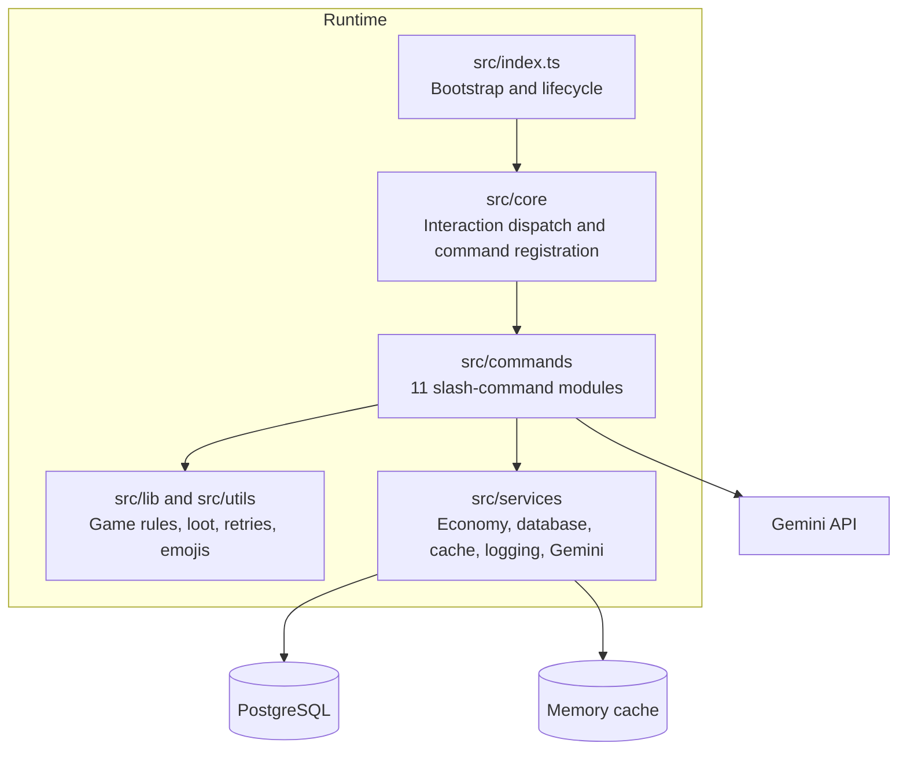
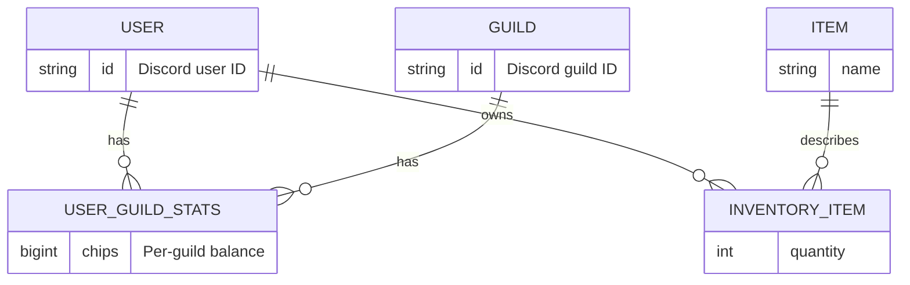
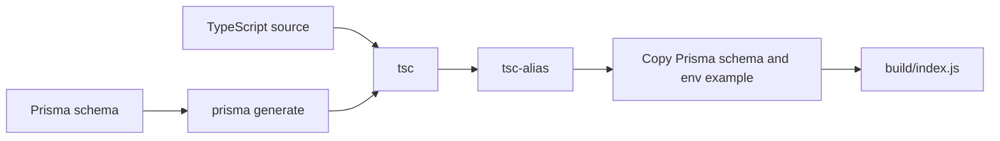

# Chip Minigame Parlor: Tech Stack

Snapshot taken 2026-08-27 from the committed manifests and source tree. This is a Discord bot service, not a web application.

## At a glance



| Area | Current choice |
| --- | --- |
| Runtime | Node.js 22+ with native ESM |
| Language | TypeScript 5.7 (ESNext output) |
| Bot platform | discord.js 14.18, Discord API v10 REST registration |
| Persistence | Prisma 6.5 and PostgreSQL |
| Hosted database direction | Neon packages are declared; the source currently uses `PrismaClient` directly |
| AI | Google Generative AI SDK, Gemini 2.0 Flash for `/8ball` |
| Cache | `cache-manager` + Keyv + Cacheable in-process memory store |
| Logging | Pino, with `pino-pretty` in development |
| Validation | Zod in interactive game state handling |
| Tests | Vitest with V8 coverage configuration |
| Code quality | Biome 1.9 (formatting, linting, import organization) |
| Package manager | npm (`package-lock.json`, lockfile v3) |

## Composition



The entry point loads environment variables, creates the logger, cache, Prisma, and economy services, validates the Discord token and database URL, checks the database with `SELECT 1`, then starts the Discord client. It handles `SIGINT` and `SIGTERM` by disconnecting the database and cache before destroying the client.

Discord interactions are limited to chat-input slash commands. Command definitions are statically collected in `src/commands/index.ts`, loaded into a Discord collection once at startup, and registered as global application commands through Discord's REST API when the client is ready.

## Product surface

```text
Command modules  [###########] 11
Economy          [#####......]  5  balance, daily, fishing, leaderboard, sell
Games            [######.....]  6  8ball, bigblast, blackcat, catheist, coinflip, connect4tress
```

The source contains 4,818 TypeScript lines outside `src/scripts`. Game-specific rules live mainly in `src/utils`; reusable application behavior is concentrated in the services layer.

## Data and state



Prisma's schema targets PostgreSQL. Its durable model is intentionally guild-scoped: `UserGuildStats` joins a Discord user and guild, and stores chip balance, games played, and the daily-claim timestamp. Inventory is global to a user and references an `Item` catalogue. The schema has no committed migration files yet, only `prisma/schema.prisma`.

The cache is local process memory only, with a default 60-second TTL and an LRU limit of 500 items. It is useful for fast reads but does not share state across bot replicas or survive a restart.

## Integrations and configuration

| Integration | Purpose | Required configuration |
| --- | --- | --- |
| Discord | Gateway events and global slash-command registration | `DISCORD_BOT_TOKEN`, `DISCORD_CLIENT_ID` |
| PostgreSQL | Economy, guild statistics, inventory, item catalogue | `DATABASE_URL`; Prisma schema also requires `DIRECT_URL` |
| Google Gemini | `/8ball` response generation | `GEMINI_API_KEY` |

`NODE_ENV` controls the Pino logging level and whether Prisma emits query-level logs. The declared Neon serverless and Prisma Neon-adapter packages signal an intended Neon deployment, but they are not imported in the current source path.

## Build, development, and verification



| Workflow | Script and tooling |
| --- | --- |
| Local bot loop | `npm run dev` runs `tsx watch src/index.ts` |
| Production build | clean, `prisma generate`, `tsc`, `tsc-alias`, and `cpx` asset copying |
| Production start | `node build/index.js` |
| Database work | Prisma migrate, generate, and Studio scripts |
| Command publication | `npm run commands:register` |
| Lint and format | `npm run check`, `npm run fix`, and `npm run format` using Biome |
| Tests | `vitest run --silent`; coverage targets are 90% for lines, functions, branches, and statements |

Vite is not an application bundler here: `vite.config.ts` configures Vitest and TypeScript path resolution, while the actual build uses TypeScript directly. No `*.test.ts` files are currently present, so Vitest is configured but has no checked-in test suite to run.

## Current implementation notes

- The application combines direct service construction in `src/index.ts` with remaining `tsyringe` container usage during command loading and registration. That is the present dependency-injection shape, rather than a fully container-managed design.
- `.env.example` includes the Discord, database, and Gemini variables, but it omits `DIRECT_URL`, which the Prisma datasource declares as required. The README does document it.
- `npm run check` could not be executed in this checkout because `node_modules` is absent (`biome: command not found`). No dependencies were installed or source files changed to produce this snapshot.

## Primary source files

- [package.json](package.json) - declared runtime, dependencies, and scripts
- [src/index.ts](src/index.ts) - process bootstrap and bot lifecycle
- [src/core/handleInteraction.ts](src/core/handleInteraction.ts) - slash-command dispatch
- [src/core/registerCommands.ts](src/core/registerCommands.ts) - Discord REST registration
- [prisma/schema.prisma](prisma/schema.prisma) - persistent data model
- [vite.config.ts](vite.config.ts) and [biome.json](biome.json) - test and code-quality configuration
