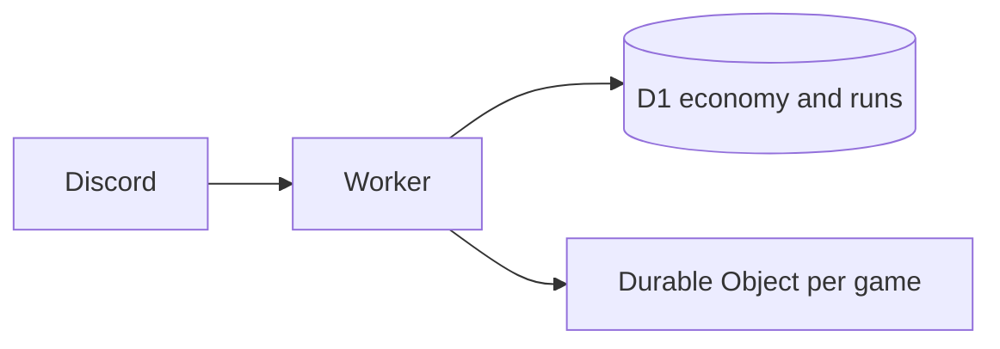

# Current technology stack

| Layer                  | Choice                                                     |
| ---------------------- | ---------------------------------------------------------- |
| Runtime and host       | Cloudflare Workers, managed with Wrangler and Bun          |
| Discord transport      | HTTP Interactions with Ed25519 signature verification      |
| Durable data           | Cloudflare D1 (SQLite) with Drizzle ORM and SQL migrations |
| Live game coordination | SQLite-backed Durable Objects, one object per game/lobby   |
| Tests                  | Vitest with Cloudflare's Worker plugin                     |
| Quality                | Oxlint, Oxfmt, and the vendored anti-slop rules            |

The old Discord gateway, Prisma/Postgres/Neon, and in-process cache have been removed. Big Blast is the first game migrated: it currently provides a persistent, four-player lobby with join/start components and a timeout alarm. Turn mechanics are intentionally the next feature slice.
